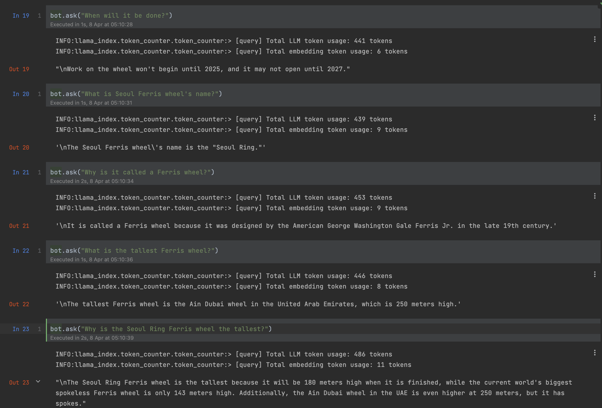

# pdf-gpt
A project that uses the GPT API to find what you need using a PDF file as context.

## requirements
The OPENAI_API_KEY environment variable is required on the execution machine.

## install
```bash
poetry install
```

## description
It reads a PDF file and performs a question/answer based on that file.

The basic flow of operations is as follows.
```
1. load PDF file
2. split the text
3. semantic search between the split text list and the question content
4. select the top k corresponding sentences
5. create a new list of sentences by combining n sentences before and after the selected sentences
6. generate question prompts in the context of the combined sentences and send them to LLM
```

Current limitations include
```
- Performance is highly dependent on how text is split per document. 
- Current publicly available semantic search methods only work well in relatively short contexts (especially given the large differences in token length between languages). Also, publicly available models do not perform well in multiple languages other than English.
- The limited size of LLM inputs currently available in the public domain makes it impossible to cope with cases where the correct answer is only known by looking at a large amount of information.
```

## usage
See the file `use_pdf_gpt.ipynb`

Example screenshot using the `./documents/article.pdf` file


## todo
- Add a question method to remember previous conversations
- Adding a web UI